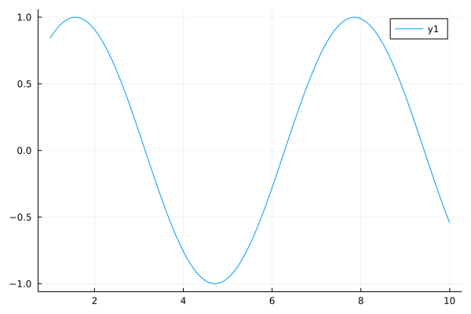

<!--more-->

## En cours d'écriture ✍️

Ceci est un exemple de code julia et son résultat une fois exécuté

````julia
using Plots
gr()
x = 1:0.1:10
y = sin.(x)

plot(x,y, fmt = :png)
````


---

*This page was generated using [Literate.jl](https://github.com/fredrikekre/Literate.jl).*

